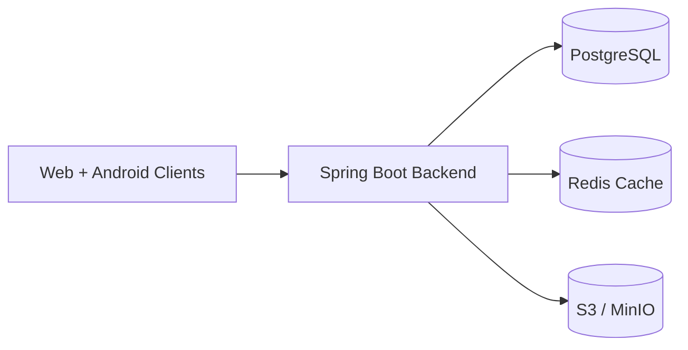

# 04-DB-Architecture.md  
# Database Architecture – Learning & Training Platform

---

## 1. Purpose

This document describes the complete database architecture of the  
**Learning & Training Platform (Admin + Student | Web + Android)**.

The database layer is designed to support:

- authentication and role based access
- content and blogging (Markdown + Mermaid)
- quizzes and assessments
- subscriptions and billing
- rewards and referrals
- notifications
- audit and activity tracking
- scalable media handling through external object storage

---

## 2. Database Strategy

The platform uses a **hybrid storage model**:

| Layer | Technology | Purpose |
-----|-----------
Primary Database | PostgreSQL | All transactional and business data
Cache & Temporary Store | Redis | tokens, OTP, rewards cache, session, rate-limit
Object Storage | S3 / MinIO | images, videos, attachments, blog assets

PostgreSQL remains the **single source of truth**.

---

## 3. High Level Data Architecture

